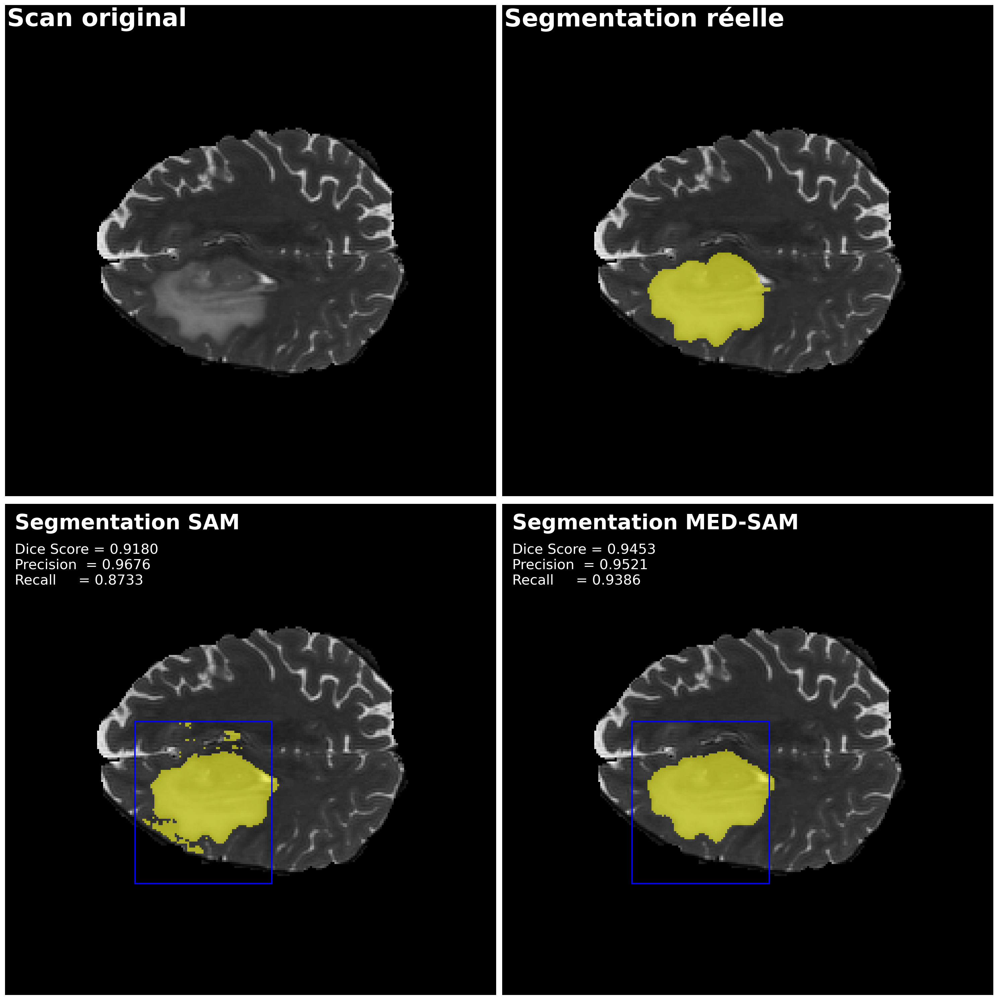
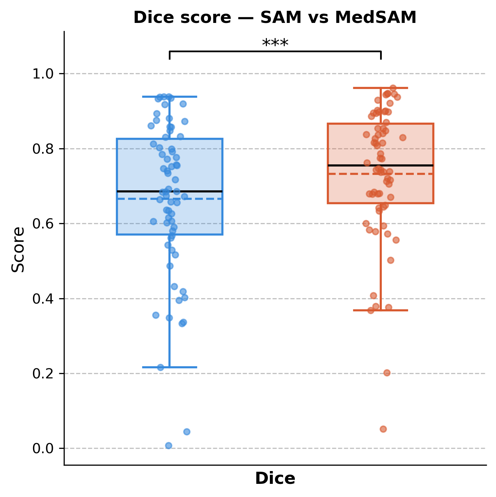
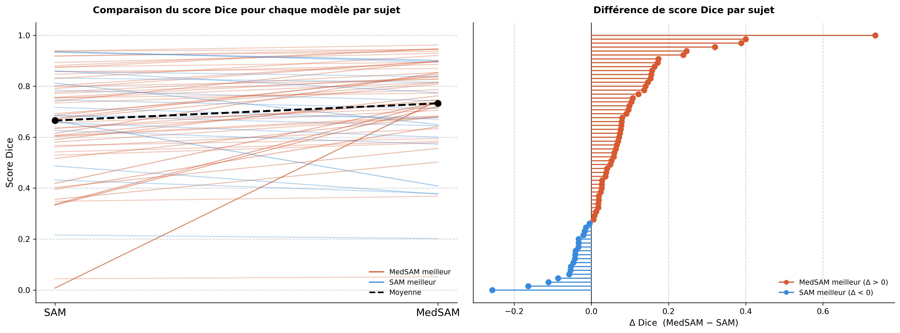
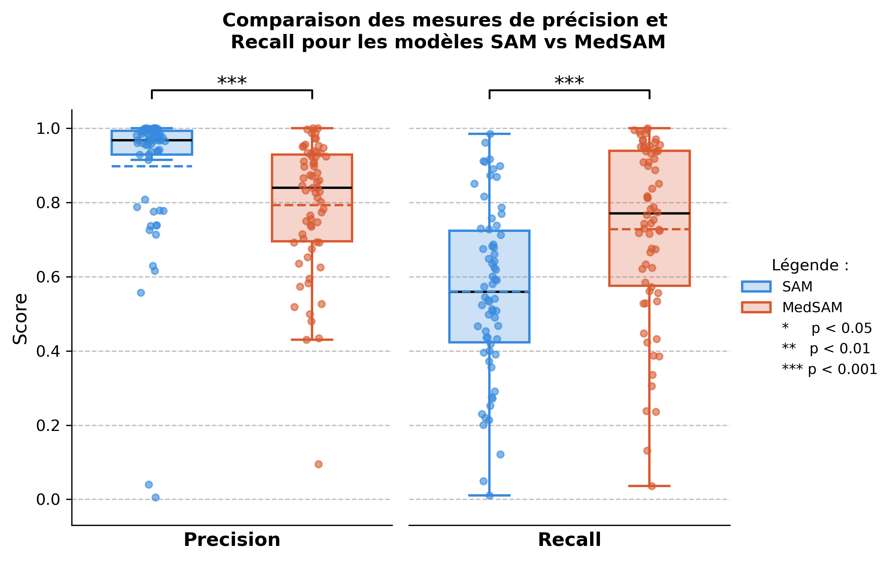
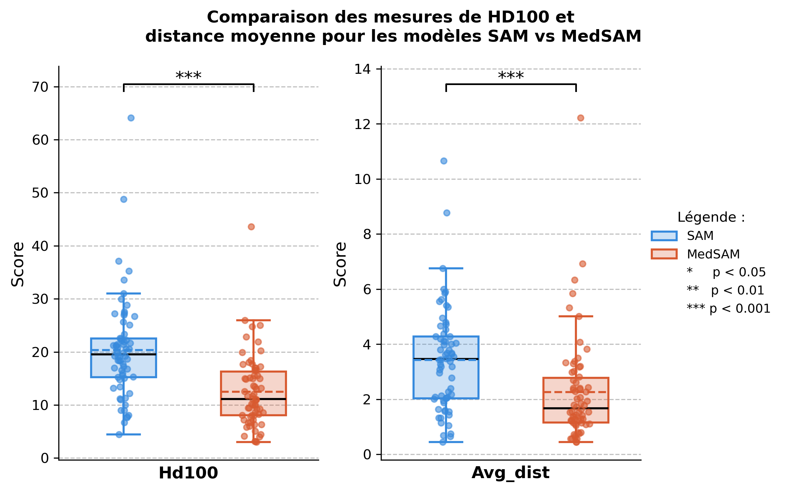

Bonjour! Folder pour reproduire les analyses faites dans le cadre de mon projet de reproduction à 
partir du projet : 

Brain Tumor Segmentation via SAM-based fine-tuning on structural MRI images

# Informations générales projet 

Auteur : Alex Peng

Repo github : https://github.com/AlexPeng517/BHS2023_Project_SAM_MRI/tree/main?tab=readme-ov-file

URL brainhack : https://school-brainhack.github.io/project/

brain_tumor_segmentation_via_sam-based_fine-tuning_on_structural_mri_images/

## Description du projet 
Le projet choisi a pour but de faire la segmentation de tumeur cérébrale sur des sur des images d’IRM structurelle du cerveau. L’objectif principal est de comparer les performances de deux modèles de segmentation : le modèle MedSAM et une version du modèle fine-tunée par un étudiant.

Parmmis les plus récents développements dans le domaine du "computer vision" se trouve un modèle développé par Méta Segments Anything Model (SAM) qui a pour but de segmenter une grande variété d’objets dans des images naturelles. Par la suite, des chercheurs de l’Université de Toronto ont adapté ce modèle au domaine médical en le spécialisant sur des images biomédicales, ce qui a donné MedSAM, qui montre de meilleures performances pour ce type de données que le SAM original. Le projet reprend cette idée, en fine-tunant le modèle SAM sur des images d’IRM de tumeurs cérébrales, afin d’améliorer ses performances pour cette tâche.

Les deux modèles (SAM original et MED-SAM (fined tuné)) sont ensuite comparés avec une métrique de Dice Score, et une visualisation de la segmentation par les deux modèles sont offertes. 

### Base de données 

Le projet utilise deux bases de données ouvertes qui contiennent des images IRM anatomiques ainsi que la segmentation ("ground-truth"), c'est à dire ce qui est utilisé comme référence de la délimitation de la tumeur. 

La première base, utilisée pour le fine-tuning du modèle, provient du jeu de données Brain Tumor Segmentation disponible sur Kaggle (source originale : Jun Cheng). Elle contient 3064 images IRM T1 avec injection de contraste, issues de 233 patients et réparties en trois types de tumeurs : méningiomes (708 coupes), gliomes (1426 coupes) et adénomes hypophysaires (930 coupes).

La deuxième, utilisée pour comparer les performances du modèle original et du modèle fine-tuné (évaluation du modèle), est la base BRaTS 2021 (RSNA-ASNR-MICCAI Brain Tumor Segmentation Challenge). Elle comprend 1666 examens avec des séquences T1, T2 et T2-FLAIR au format NIfTI (.nii.gz), accompagnées de leurs segmentations de référence. C'est la deuxième qui est pertinante pour moi, car je compte reproduire le notebook d'évaluation et ajouter des visualisations qui seront produites à partir de ces images. 

### Résultats 
La comparaison entre les modèles est faite à partir des Dice score. 
Les résultats montrent que le modèle fine-tuned performe mieux.


## Choix du projet 
J'ai choisi ce projet car une des techniques d'analyse de données en neuroscience cognitive avec laquelle je suis le moins à l'aise est l'utilisation de modèles d'intelligence artificielle. Ce projet est une bonne façon pour moi de me familiariser avec ceux-ci, sans avoir à entraîner un modèle dans son ensemble.

Pour plus de détails concernant le projet, voir Achive/Présentation_initiale.md


# Résumé du contenu des codes : 

a. Notebook explicatif qui prend un sujet et passe à travers toutes les étapes et produit les visualisations 



b. Fonctions à rouler pour faire l'analyse sur tous les sujets : 

	invoke run-boucle 

	invoke run-stats

	invoke run-figures

| Fichier/Dossier | Description |
|---|---|
| `Notebooks/` | Folder de notebooks : explicatif et pour les figures |
| `code/` | Fichier de codes pour les analyses |
| `source_data/` | Dossier avec les scans |
| `output_data/` | Dossier ou les figures et et resultats sont produits |
| `output_data/` | Dossier ou copier les checkpoints des modèles |
| `REPO` | Repo original |
| `tasks.py` | Pipeline automatisé invoke |
| `invoke.yaml` | Configuration du pipeline |
| `environment.ylm` | Fichier pour la création de l'environnement virtuel |
| `notes.txt` | timeline du projet |
| `documentation_taches.md` | Documentation détaillés des tâches |
| `Archive` | Fichier avec contenu du repo tâche 1 |
| `LICENSE` | Licence MIT du projet |

# Reproductibilité

Pour reproduire les mêmes analyses et figures que moi, j'ai roulé sur un sous-ensemble de participants par souci d'espace de stockage et de RAM, c'est à dire : 
Participants 00000 à 00099 

# Étapes : 

## 1. Initialiser l'environnement virtuel : 
conda env create -f environment.yml 
conda activate env_projet_final 

## 2. Télécharger les données 
Les données proviennent du dataset BraTS 2021 Task 1 sur Kaggle. Pour les télécharger, effectuer ces étapes : 

a. Prérequis : configurer l'API Kaggle

- Créer un compte sur kaggle.com

- Suivre les instructions pour créer un token : https://github.com/Kaggle/kaggle-cli/blob/main/docs/README.md#api-credentials

b. Télécharger les données :  
    kaggle datasets download dschettler8845/brats-2021-task1 -p source_data

c. Dézipper les données :  
    tar -xf source_data/BraTS2021_Training_Data.tar -C source_data

Les données doivent être dans ce format : 

```
├── source_data
│   ├── BraTS2021_00000
│   │   ├── BraTS2021_00000_seg.nii.gz
│   │   └── BraTS2021_00000_t2.nii.gz
│   ├── BraTS2021_00002
│   │   ├── BraTS2021_00002_seg.nii.gz
│   │   └── BraTS2021_00002_t2.nii.gz
...
```

d. Vérifier que les modèles sont présents   
Les modèles checkpoints des modèles sont inclus dans modèles/   
Les modèles ont été trouvés sur :   
	- MED-SAM : https://drive.google.com/drive/folders/1MbHo0qBfkQYARUhB-DAhbD5a4lhmYNqs   
	- SAM : https://github.com/facebookresearch/segment-anything/blob/main/README.md   

## Exécuter le code et les analyses avec invoke! 

### **Étape 1**: Boucle pour segmenter chaque sujet 
Passe à travers tous les sujets de source data, et segmente la tumeur d'une slice aléatoire avec les deux modèles analysés 
```
bash
run-boucle
```

### **Étape 3**: Boucle pour extraire les métriques 
Pour chaque segmentation, quantifie la qualité avec plusieurs métriques (expliqués dans le notebook explicatif)
```
bash
invoke stats
```

### **Étape 4** : Notebook avec toutes les visualisations 
Ajoute les figures dans output_data/Figures 
```
bash
invoke run-figures
```

## Éléments optionnels : 

### Visualisation pour un sujet
Si un sujet veut être plus analysé, produit la visualisation du scan original, la tumeur et les segmentations 
```
bash
invoke save-visu-sujet --sujet BraTS2021_XXXXX
```

### Notebook explicatif 
Passe à travers toutes les étapes pour le sujet BraTS2021_00002 par défault, avec des explications 
```
bash
invoke run-notebook-explicatif 
```

# Tâches 

Pour voir les tâches initiales, présentés à la présentation de mis session, voir Presentation_initiale.md 

Pour une documentation plus précise sur la timeline et les issues rencontrés de chaque tâche, voir documentation_taches.md   
Pour mes notes (très personnelles et brouillones, plus comme un journal de bord que je tenais) à travers le temps, voir notes.txt 

### Tâches originales : 

1. Reproduction du notebook
2. Ajout de métriques et de visualisations -> tâche 3
3. ~~Notebook explicatif sur le modèle~~ Automatisation via invoke

## 1. Tâche 1 : Reproduction du Notebook 

But initial : Je veux reproduire le nootebook d'application des deux modèles entraînés
J'ai combiné avec la partie éducative de la tâche initiale 3 

Ce qui a été fait : 
- Reproduction du Notebook initial
  - Documentation de issues
    - Trouver les données, non disponible sur le lien avec le github, et trouver comment mettre dans le bon format
    - Difficultés avec certains packages et une fonction écrite par l'élève manquante
    - Ajustements car le code était fait pour avoir un GPU
    - Problématiques dans certaines fonctions (utilisation de variables globales inappropriées)
    - Changement pour une adaptation si la slice sélectionnée n'a pas de tumeur afin de maximiser tous les participants
    - Changements mineurs dans le code, comme ajout de titres, commentaires explicatifs et organisation
- Simplification et ajouts de commentaires
- Refactorisation de fonctions
- Création d'un environment.yml
  - Certains packages ont dû être installés en pip 

J'ai travaillé sur le Notebook_initial_reproduit.ipynb   
Il était initialement dans un repo forked du projet original  
Je l'ai merge (pour l'historique) à la fin, voir Note repo git  

## 2. Tâche 2 : Script et reproductibilité 

Tâche ajoutée après le cours sur les scripts  
La dernière tâche était initialement sur un Notebook explicatif du modèle, mais les analyses étaient 
toutes regroupés dans un seul notebook, avec des chemins de fichiers hardcodés après ma première tâche et je considérais qu'il restait du travail considérable pour rendre les analyses reproductibles.  
J'ai voulu d'abord séparer les grandes boucles d'analyses initiales en petites fonctions, puis scripts ce qui a grandement aidé la lisibilité, puis j'ai voulu accomplir le défi de mettre en format airoh.   
- Séparé le notebook en 2 parties indépendantes :
  - **a. Partie tutorielle** (NOTEBOOK) : explique chaque étape avec plusieurs visualisations
  - **b. Segmentation automatique** : analyse de tous les sujets et comparaison des métriques pour les deux modèles

- Rendu l'ensemble des analyses séparé en scripts exécutables appelés à partir de invoke :
  - Codes explicatifs pour la section a. :
    - `run-notebook-explicatif` : roule le notebook de partie a au complet
    - `run-visu-sujet` : sauvegarde la visualisation finale pour un sujet sélectionné
- Codes pour l'analyse automatique de la section b. :
    - `run-boucle`
    - `run-stats`
    - `run-figures`

Ces commandes produisent une analyse statistique complète sur des couches aléatoires de segmentation pour chaque sujet.

- Une fois l'environnement installé et les données téléchargées selon les instructions du README, l'analyse est totalement reproductible à partir de commandes invoke.

## 3. Tâche 3 : Visualisation et métriques

**Tâche originale :**
- Bonifier la figure de visualisation et documenter les étapes et choix méthodologiques
- Ajouter une métrique de comparaison

**Ce qui a été fait :**
- Recherche et sélection de métriques
- Amélioration du graphique de Dice score :
  - Ajout des points individuels, barre de significativité, titre, axes et ligne de médiane
  - Amélioration de l'esthétique
- Ajout de 4 métriques supplémentaires :
  - 2 de chevauchement (Precision, Recall)
  - 2 de périmètre (HD100, distance moyenne)
  - Explications et justifications dans les notebooks
- Graphiques comparant les 4 métriques conjointement par type (chevauchement et périmètre)
- Graphique illustrant l'évolution du Dice score par sujet
Toutes les figures finales sont dans output_data/Figures 

### Comparaison du Dice score 

Visualisation originale :   


Visualisations ajoutés :   


 
Le projet original obtenait un dice autour de 0.65 pour MEDSAM et autour de 0.72 pour SAM (obtenu du graphique)

Mes analyses produisent un résultat très proche, avec pour SAM 0.67 (0.90) et pour MEDSAM 0.73 (0.18). La différence est significative avec t = -3.92 (p = 0.0002). 

### Métriques de précision et recall



On voit ici des différences importantes entre les deux modèles. SAM obtient une précision très élevée et homogène = quand il segmente quelque chose, c'est presque toujours du vrai tissu tumoral (peu de faux positifs). MedSAM est significativement plus bas, ce qui veut dire qu'il inclut davantage de tissu non tumoral dans ses segmentations.

Par contre, SAM a un recall beaucoup plus faible et très variable — il manque une grande partie du tissu tumoral réel (beaucoup de faux négatifs), alors que MedSAM en détecte une plus grande proportion. SAM est dont plus précis mais conservateur, en manquant des zones tumorales (ou MED-SAM performe mieux) mais il a presque toujours raison dans son inclusion d'un voxel comme une tumeur. 


### Métriques de périmètre 



Ici on peut voir que pour les deux métriques de périmètre, MEDSAM performe mieux car la distance entre la segmentation prédite est réelle est significativement plus faible que MEDSAM 

## Conclusion 

Le modèle fine tuné (MED-SAM) performe mieux sur toutes les métriques sauf la précision. Ce qui veut dire qu'il détecte plus de tissu tumoral et ses contours sont plus proches des vrais bords. SAM est très précis (peu de faux positifs), mais il segmente des zones petites et conservatrices, en manquant souvent des parties de tumeur (recall et dice bas) et a des contours loins des bords (périmètre élevés) comparativement à medsam. 

En conclusion les résultats du projet original d'amélioration du Dice score sont reproduit, et l'ajout de nouvelles métriques permet de mieux comprendre les forces et faiblesses de chaque modèle.

# Utilisation d'IA 
L'intelligence artificielle a été utilisée dans ce projet, surtout pour l'aide à la compréhension de certains concepts, la paufination de certains éléments de code et l'interprétation de messages d'erreurs. 

# Note repo git 

Ce git repo a été commencé lors de la tâche 3, car j'avais besoin d'un nouveau folder ou tester les composantes à partir de invoke, et dans l'original j'étais rendu avec trop de codes / scripts et fonctions non néttoyés 

Ce repo comprend quand même plusieurs commits lié à la tâche 3 (visualisation) qui a été faite en parrallèle 
À la fin, j'ai merge les historiques : 
git remote add ancien-repo /home/cassa2/psy3019/projet
git fetch ancien-repo
git merge ancien-repo/main --allow-unrelated-histories -m "Fusion historique ancien projet"

Les éléments importants du premier repo sont dans Archive : 
- Le notebook initial avec ma documentation de reproduction (initiale)
- La présentation d'étape avec les tâches originales, le choix et la description du projet 

L'historique documente aussi l'évolution des premiers scripts exécutables dans le dossier code reproductible : git log --all -- codes_reproductibles/

