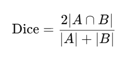
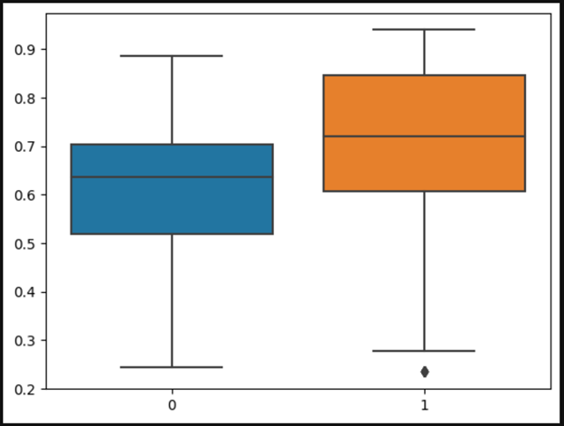

# Sevigny_Projetfinal
Description de mon projet final pour la présentation du 2/26/2026

# Description du projet choisi : 

## Informations générales 
Titre du projet : Brain Tumor Segmentation via SAM-based fine-tuning on structural MRI images

Auteur : Alex Peng

Repo github : https://github.com/AlexPeng517/BHS2023_Project_SAM_MRI/tree/main?tab=readme-ov-file 

URL brainhack : https://school-brainhack.github.io/project/brain_tumor_segmentation_via_sam-based_fine-tuning_on_structural_mri_images/ 

## Description du projet 
Le projet choisi a pour but de faire la segmentation de tumeur cérébrale sur des sur des images d’IRM structurelle du cerveau. L’objectif principal est de comparer les performances de deux modèles de segmentation : le modèle MedSAM et une version du modèle fine-tunée par un étudiant.

Parmmis les plus récents développements dans le domaine du "computer vision" se trouve un modèle développé par Méta Segments Anything Model (SAM) qui a pour but de segmenter une grande variété d’objets dans des images naturelles. Par la suite, des chercheurs de l’Université de Toronto ont adapté ce modèle au domaine médical en le spécialisant sur des images biomédicales, ce qui a donné MedSAM, qui montre de meilleures performances pour ce type de données que le SAM original. Le projet reprend cette idée, en fine-tunant le modèle SAM sur des images d’IRM de tumeurs cérébrales, afin d’améliorer ses performances pour cette tâche.

Les deux modèles (SAM original et MED-SAM (fined tuné)) sont ensuite comparés avec une métrique de Dice Score, et une visualisation de la segmentation par les deux modèles sont offertes. 

### Base de données 

Le projet utilise deux bases de données ouvertes qui contiennent des images IRM anatomiques ainsi que la segmentation ("ground-truth"), c'est à dire ce qui est utilisé comme référence de la délimitation de la tumeur. 

La première base, utilisée pour le fine-tuning du modèle, provient du jeu de données Brain Tumor Segmentation disponible sur Kaggle (source originale : Jun Cheng). Elle contient 3064 images IRM T1 avec injection de contraste, issues de 233 patients et réparties en trois types de tumeurs : méningiomes (708 coupes), gliomes (1426 coupes) et adénomes hypophysaires (930 coupes).

La deuxième, utilisée pour comparer les performances du modèle original et du modèle fine-tuné (évaluation du modèle), est la base BRaTS 2021 (RSNA-ASNR-MICCAI Brain Tumor Segmentation Challenge). Elle comprend 1666 examens avec des séquences T1, T2 et T2-FLAIR au format NIfTI (.nii.gz), accompagnées de leurs segmentations de référence. C'est la deuxième qui est pertinante pour moi, car je compte reproduire le notebook d'évaluation et ajouter des visualisations qui seront produites à partir de ces images. 

### Résultats 
La comparaison entre les modèles est faite à partir des Dice score. C'est une métrique qui est spécifiquement utilisée pour mesurer le recouvrement entre deux ensembles, donc ici la segmentation par le modèle et la référence. 

Les résultats montrent que le modèle fine-tune performe mieux.

## Choix du projet 
J'ai choisi ce projet car une des techniques d'analyse de données en neuroscience cognitive avec laquelle je suis le moins à l'aise est l'utilisation de modèles d'intelligence artificielle. Ce projet est une bonne façon pour moi de me familiariser avec ceux-ci, sans avoir à entraîner un modèle dans son ensemble. Un autre aspect que je trouve interressant est la simplicité de la tâche qui permet des images facilement visualisables. 

# Tâches 

## Tâche 1 : Reproduction du Notebook 
Le projet comporte 2 notebook, l'entraînement du modèle et son application (lui feed des données tests, analyser les sorties) 

Je veux reproduire le nootebook d'application des deux modèles entraînés 
- Configurer l'environnement (tout download les packages)
- Reproduire l'organisation des données / fichiers nécéssaires (selon les chemins spécifiés) 
- Download les modèles entrainés (possiblement devoir ajuster car le modèle est disponible sur google drive) 
- Documenter les étapes de reproductions (bogues rencontrés, solutions) 

Bonification possible 
- Résumer les étapes de download des packages en un 
	- Environment.ylm 
	- Requirements.txt 
- Ajouter des instructions de reproduction claires dans le README. (basé sur mes commentaires / notes de reproduction) 

## Tâche 2 : Améliorer la comparaison entre les modèles 
- Bonifier la figure de visualisation 
	- Documenter les étapes, choix méthodologiques et artistiques 
- Ajouter une métrique de comparaison (en ce moment les modèles sont uniquement comparés selon leur performance au DICE score) ex : Kappa, Hausdorff Distance (HD = distance max entre les contours), Average Symmetric Surface Distance (ASSD = Distance moyenne entre les surfaces des deux segmentations)

Bonification possible : Ajouter des graphiques diagnostiques spécifiquement reliés aux modèles 

## Tâche 3 : Notebook pédagogique 
L’objectif de cette tâche est de produire un notebook destiné à un public débutant qui explique de manière progressive le processus de fine-tuning du modèle SAM pour la segmentation de tumeurs cérébrales. C'est la partie du travail que je ne touche pas à date (entraînement du modèle, notebook 1) et je suis interessée à comprendre théoriquement comment le modèle fonctionne et faire un travail de vulgarisation pour comprendre ce qui se passe derrière les commandes clés du notebook d'entraînement. 
- Présenter SAM et MedSAM : objectifs et différences
- Expliquer le principe de modèle de fondation et de fine-tuning dans le contexte médical
- Éléments mathématiques principaux

## Tâche supplémentaire potentielle
Si une des tâche ne s'avère pas possible / trop simple, je prévois refactoriser le notebook en pipeline réutilisable (fonctions). 

# Références 

Peng, L.-X. A. (2023). BHS2023_Project_SAM_MRI: Brain tumor segmentation via SAM-based fine-tuning on structural MRI images [Code source]. GitHub. https://github.com/AlexPeng517/BHS2023_Project_SAM_MRI 

Segment Anything (original paper) https://arxiv.org/abs/2304.02643
Segment Anything in Medical Images (MedSAM) https://arxiv.org/pdf/2304.12306.pdf
MedSAM github repository https://github.com/bowang-lab/MedSAM
